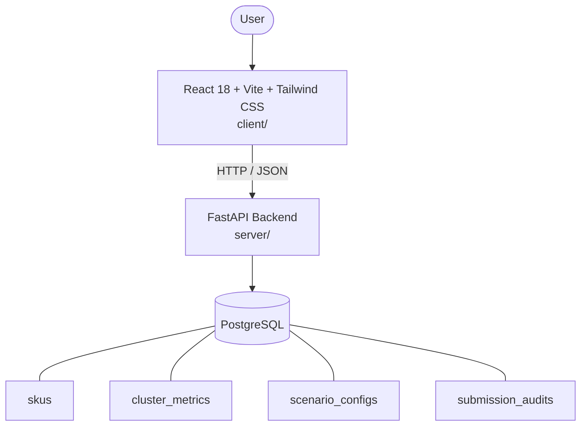

# Architecture

_Auto-generated by the SDLC Assistant from the generated codebase and the approved Feature Spec (latest: SCRUM-266). Regenerated on each push._

## System Diagram

## Tech Stack
- **language**: Python
- **backend_framework**: FastAPI
- **orm**: SQLAlchemy 2.x
- **database**: PostgreSQL
- **frontend**: React 18 + Vite + Tailwind CSS
- **cloud_provider**: GCP
- **constitution_section_4_followed**: True

## Backend Modules (server/)
- server/__init__.py
- server/api/__init__.py
- server/api/v1/__init__.py
- server/api/v1/endpoints/__init__.py
- server/api/v1/endpoints/auth.py
- server/api/v1/endpoints/guardrails.py
- server/api/v1/endpoints/metrics.py
- server/api/v1/endpoints/scenarios.py
- server/api/v1/endpoints/skus.py
- server/api/v1/endpoints/submissions.py
- server/database.py
- server/main.py
- server/models.py
- server/schemas.py
- server/services/__init__.py
- server/services/assortment_service.py
- server/tests/__init__.py
- server/tests/conftest.py
- server/tests/test_auth.py
- server/tests/test_guardrails.py
- server/tests/test_metrics.py
- server/tests/test_scenarios.py
- server/tests/test_skus.py
- server/tests/test_submissions.py

## Frontend Modules (client/)
- (no client/ files found yet)

## API Endpoints
- GET /api/v1/metrics/kpi
- GET /api/v1/skus
- POST /api/v1/scenarios/evaluate
- POST /api/v1/submissions

## Data Model
- skus
- cluster_metrics
- scenario_configs
- submission_audits
