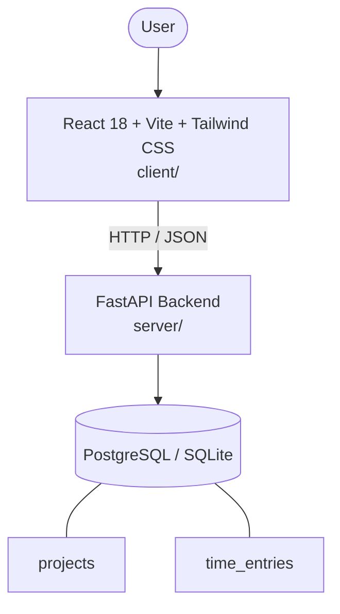

# Architecture

_Auto-generated by the SDLC Assistant from the generated codebase and the approved Feature Spec (latest: SCRUM-58). Regenerated on each push._

## System Diagram

## Tech Stack
- **language**: Python 3.11
- **backend_framework**: FastAPI
- **orm**: SQLAlchemy 2.x
- **database**: PostgreSQL / SQLite
- **frontend**: React 18 + Vite + Tailwind CSS
- **cloud_provider**: GCP (Cloud Run)
- **constitution_section_4_followed**: True

## Backend Modules (server/)
- server/__init__.py
- server/database.py
- server/main.py
- server/models/__init__.py
- server/models/project.py
- server/models/time_entry.py
- server/routers/__init__.py
- server/routers/projects.py
- server/routers/time_entries.py
- server/schemas/__init__.py
- server/schemas/project.py
- server/schemas/time_entry.py
- server/tests/__init__.py
- server/tests/conftest.py
- server/tests/test_projects.py
- server/tests/test_time_entries.py

## Frontend Modules (client/)
- (no client/ files found yet)

## API Endpoints
- GET /api/v1/projects
- POST /api/v1/projects
- PUT /api/v1/projects/{id}
- DELETE /api/v1/projects/{id}
- POST /api/v1/time-entries
- GET /api/v1/time-entries/daily-summary

## Data Model
- projects
- time_entries
