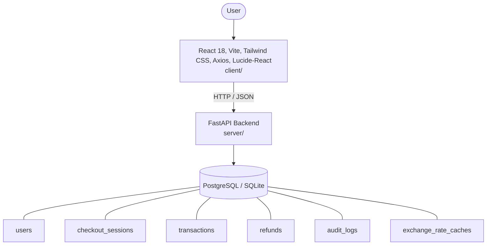

# Architecture

_Auto-generated by the SDLC Assistant from the generated codebase and the approved Feature Spec (latest: SCRUM-241). Regenerated on each push._

## System Diagram

## Tech Stack
- **language**: Python 3.11 / JavaScript (React 18)
- **backend_framework**: FastAPI
- **orm**: SQLAlchemy 2.0
- **database**: PostgreSQL / SQLite
- **frontend**: React 18, Vite, Tailwind CSS, Axios, Lucide-React
- **cloud_provider**: GCP (Cloud Run, Cloud SQL, GAR)
- **constitution_section_4_followed**: True

## Backend Modules (server/)
- server/__init__.py
- server/api/__init__.py
- server/api/v1/__init__.py
- server/api/v1/audit.py
- server/api/v1/payments.py
- server/api/v1/refunds.py
- server/api/v1/webhooks.py
- server/config.py
- server/database.py
- server/main.py
- server/models.py
- server/schemas.py
- server/services/__init__.py
- server/services/audit_service.py
- server/services/currency_service.py
- server/services/stripe_service.py
- server/services/wallet_service.py
- server/tests/__init__.py
- server/tests/conftest.py
- server/tests/test_audit.py
- server/tests/test_payments.py
- server/tests/test_refunds.py
- server/tests/test_webhooks.py

## Frontend Modules (client/)
- (no client/ files found yet)

## API Endpoints
- POST /api/v1/payments/checkout-session
- POST /api/v1/payments/digital-wallet
- GET /api/v1/payments/transactions
- GET /api/v1/payments/transactions/{id}
- GET /api/v1/payments/rates
- POST /api/v1/refunds
- GET /api/v1/refunds
- GET /api/v1/audit-logs
- POST /api/v1/webhooks/stripe

## Data Model
- users
- checkout_sessions
- transactions
- refunds
- audit_logs
- exchange_rate_caches
