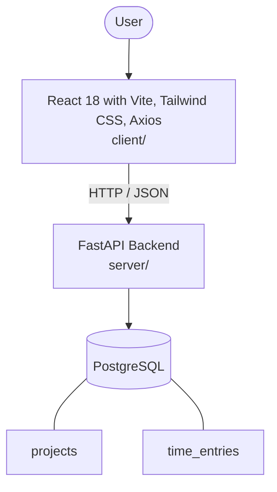

# Architecture

_Auto-generated by the SDLC Assistant from the generated codebase and the approved Feature Spec (latest: SCRUM-58). Regenerated on each push._

## System Diagram

## Tech Stack
- **language**: Python 3.11
- **backend_framework**: FastAPI
- **orm**: SQLAlchemy 2.x
- **database**: PostgreSQL
- **frontend**: React 18 with Vite, Tailwind CSS, Axios
- **cloud_provider**: GCP (Cloud Run)
- **constitution_section_4_followed**: True

## Backend Modules (server/)
- server/__init__.py
- server/crud.py
- server/database.py
- server/main.py
- server/models.py
- server/routers/__init__.py
- server/routers/projects.py
- server/routers/time_entries.py
- server/schemas.py
- server/tests/__init__.py
- server/tests/conftest.py
- server/tests/test_projects.py
- server/tests/test_time_entries.py

## Frontend Modules (client/)
- client/eslint.config.js
- client/postcss.config.js
- client/src/App.jsx
- client/src/App.test.jsx
- client/src/components/dashboard/ActivityLogCard.jsx
- client/src/components/dashboard/DailyGoalProgressCard.jsx
- client/src/components/dashboard/DarkModeToggle.jsx
- client/src/components/dashboard/DarkModeToggle.test.jsx
- client/src/components/dashboard/ManualEntryModal.jsx
- client/src/components/dashboard/TimerCard.jsx
- client/src/components/layout/Header.jsx
- client/src/components/layout/Sidebar.jsx
- client/src/context/ThemeContext.jsx
- client/src/context/ThemeContext.test.jsx
- client/src/main.jsx
- client/src/pages/DashboardPage.jsx
- client/src/pages/SettingsPage.jsx
- client/src/pages/SettingsPage.test.jsx
- client/src/services/api.js
- client/src/setup.js
- client/tailwind.config.js
- client/vite.config.js

## API Endpoints
- GET /api/v1/projects
- POST /api/v1/projects
- PUT /api/v1/projects/{id}
- DELETE /api/v1/projects/{id}
- POST /api/v1/time-entries
- GET /api/v1/time-entries/daily-summary

## Data Model
- projects
- time_entries
