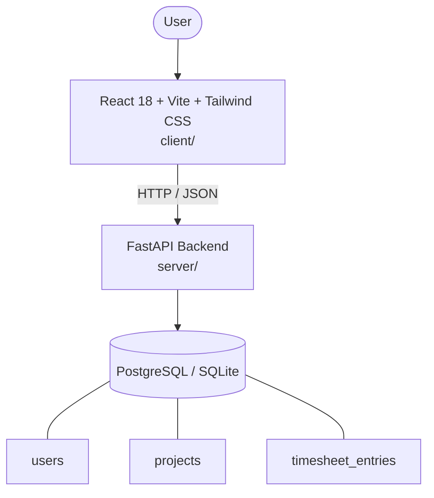

# Architecture

_Auto-generated by the SDLC Assistant from the generated codebase and the approved Feature Spec (latest: SCRUM-164). Regenerated on each push._

## System Diagram

## Tech Stack
- **language**: Python 3.11
- **backend_framework**: FastAPI
- **orm**: SQLAlchemy 2.x
- **database**: PostgreSQL / SQLite
- **frontend**: React 18 + Vite + Tailwind CSS
- **cloud_provider**: Google Cloud Platform (GCP)
- **constitution_section_4_followed**: True

## Backend Modules (server/)
- server/__init__.py
- server/alembic/__init__.py
- server/alembic/env.py
- server/alembic/versions/001_init.py
- server/alembic/versions/__init__.py
- server/database.py
- server/deps.py
- server/main.py
- server/models.py
- server/routers/__init__.py
- server/routers/auth.py
- server/routers/projects.py
- server/routers/timesheets.py
- server/schemas.py
- server/security.py
- server/tests/__init__.py
- server/tests/conftest.py
- server/tests/test_auth.py
- server/tests/test_projects.py
- server/tests/test_timesheets.py

## Frontend Modules (client/)
- (no client/ files found yet)

## API Endpoints
- POST /api/v1/auth/register
- POST /api/v1/auth/login
- GET /api/v1/projects
- POST /api/v1/projects
- PUT /api/v1/projects/{id}
- DELETE /api/v1/projects/{id}
- GET /api/v1/timesheets
- POST /api/v1/timesheets
- PUT /api/v1/timesheets/{id}
- DELETE /api/v1/timesheets/{id}
- PUT /api/v1/timesheets/{id}/approve
- PUT /api/v1/timesheets/bulk-approve
- GET /api/v1/timesheets/summary

## Data Model
- users
- projects
- timesheet_entries
